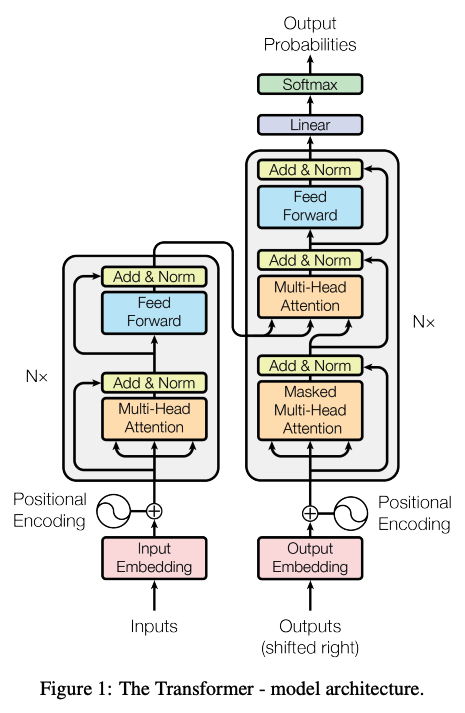

# What is Transformer (2017 - Attention Is All You Need)

A Transformer is a neural network architecture that uses self-attention to understand relationships between tokens in a sequence and efficiently process them in parallel.

---

## Key Definition

Transformer is a neural network architecture, primarily based on self-attention, which allows the model to understand relationships between tokens regardless of their position in the sequence.

---

## How it works?

A Transformer processes a sequence by repeatedly doing two things:

- **Self-attention** — each token looks at other tokens and decides which ones are important.
- **Feed-forward transformation** — each token independently passes through a small neural network to transform the information it gathered.

Residual connections and LayerNorm make this process trainable and stable.

---

## Why Transformers Are Revolutionary

### Parallelization

- **RNNs/LSTMs**: Process tokens sequentially ($O(n)$ steps), creating bottlenecks
- **Transformers**: Process all tokens in parallel, enabling massive speedups and scaling to billions of parameters

### Global Context

Unlike RNNs that maintain a fixed hidden state, Transformers directly compare every token with every other token. This allows the model to understand long-range dependencies without information decay.

### Gradient Flow

Residual connections + Layer Norm eliminate the vanishing/exploding gradient problem that plagued deep RNNs, enabling training of much deeper models.

---

## Core Technical Components

### 1. Positional Encoding

Since attention operates on all tokens simultaneously (unlike RNNs which process sequentially), the model loses information about token positions. Positional encoding injects position information into embeddings so the model knows which token comes first, second, etc.

Without it, "the cat sat on the mat" would be indistinguishable from "the mat sat on the cat."

### 2. Self-Attention Mechanism

$$\text{Attention}(Q, K, V) = \text{softmax}\left(\frac{QK^T}{\sqrt{d_k}}\right)V$$

**Why the scaling factor** $\sqrt{d_k}$**?** When $d_k$ (dimension of keys) is large, dot products become very large, causing softmax to produce extreme gradients. Dividing by $\sqrt{d_k}$ keeps attention weights stable and prevents numerical issues.

### 3. Multi-Head Attention

Instead of performing self-attention once, the model projects $Q$, $K$, and $V$ into multiple lower-dimensional subspaces in parallel ("heads"). This allows the model to simultaneously attend to different types of relationships (e.g., grammatical structure, semantic similarity, subject-verb agreement).

### 4. Residual Connections

Residual connections ($x + \text{SubLayer}(x)$) allow gradients to flow directly through the network during backpropagation. Without them, deep networks suffer from vanishing gradients. They also preserve original token information while allowing transformations.

### 5. Layer Normalization

Normalizes activations across the feature dimension for each token, stabilizing training and accelerating convergence. Applied before or after each sublayer to keep values in a healthy range.

### 6. Feed-Forward Networks

Each attention block is followed by a position-wise Feed-Forward Network (FFN) that independently transforms each token's representation. This non-linear transformation adds expressiveness to the model.

---

## Understanding Self-Attention: A Practical Example

### The Problem Statement

**The animal didn't cross the street because it was tired**

The important question is: What does "it" refer to? Does "it" refer to animal or street?

Self-attention helps the model figure this out.

### Query, Key, Value Framework

In simple terms:

- **Query (Q)** → "What am I looking for?"
- **Key (K)** → "What information do I represent?"
- **Value (V)** → "What is my actual information?"

### The Attention Formula

$$\text{softmax}\left(\frac{QK^T}{\sqrt{d_k}}\right)V$$

**Understanding** $QK^T$ **(The Transpose):**

The **T** means transpose — flipping a matrix so rows become columns and columns become rows.

- **Q shape**: (sequence_length × key_dimension)
- **K shape**: (sequence_length × key_dimension)  
- **K^T shape**: (key_dimension × sequence_length) ← rows and columns flipped

When multiplying $Q \times K^T$, we get: **(sequence_length × sequence_length)**

This creates the **attention matrix** where cell $(i,j)$ = compatibility score between token $i$ and token $j$.

**Why transpose?**
```
Without: Q × K = (seq × dim) × (seq × dim) ❌ Incompatible dimensions
With:    Q × K^T = (seq × dim) × (dim × seq) = (seq × seq) ✅ Perfect for token comparisons
```

**Embedding Dimensions (Important):**

- **d_model** = total embedding dimension (e.g., 768 in BERT)
- **num_heads** = number of attention heads (e.g., 12)
- **d_k** = d_model / num_heads (e.g., 768 / 12 = 64 per head)

Each head operates on a lower-dimensional subspace, reducing computation per head while maintaining expressiveness through parallelization.

**Steps:**

1. Compute $QK^T$ (attention scores between all token pairs)
2. Scale by $1/\sqrt{d_k}$ (normalize scores)
3. Apply softmax (convert to probability distribution)
4. Multiply by V (apply weights to values)

### Attention Scores

Suppose the model produces these simplified scores:

```
it → animal       8.5
it → street       1.2
it → tired        5.7
it → because      2.1
it → cross        1.8
```

**Observation:** There is a strong relationship between "it" and "animal".

### Softmax → Attention Weights

The raw scores are converted into probability-like weights:

```
animal     → 0.70
tired      → 0.20
because    → 0.04
cross      → 0.03
street     → 0.03
```

**Key Insight:** The Transformer looks at the entire context, not just the previous word.

### Why Softmax in Attention?

The softmax function converts raw attention scores into a probability distribution where:
- All weights sum to 1 (valid probability)
- Larger scores get exponentially larger weights
- The distribution is differentiable, allowing backpropagation to learn which tokens to attend to

This makes attention **learnable** — the model automatically discovers which tokens are relevant during training.

### The Attention Flow Diagram

This is how the attention mechanism processes the token "it":

```text
                  "it"
                   │
                   │ Query
                   ↓
        ┌─────────────────────┐
        │ Compare with Keys   │
        └─────────────────────┘
                   │
       ┌───────────┼────────────┐
       ↓           ↓            ↓
    animal       tired        street
     70%           20%           3%
       │           │             │
       ↓           ↓             ↓
   Value(V)    Value(V)      Value(V)
       │           │             │
       └───────────┼─────────────┘
                   ↓
             Weighted Sum
                   ↓
          representation of "it"
```

---

## Multi-Head Attention Explained

Suppose our Transformer has 4 attention heads.

Different heads can learn different relationships and jointly create a richer understanding:

**Head 1** — Pronoun relationship

```text
it ───────────────→ animal
       strong
```

**Head 2** — Context / reasoning relationship

**Head 3** — Verb relationship

```text
animal ─────→ cross
street ─────→ cross
```

So it understands something like:

animal → cross → street

**Head 4** — Local context

Another head might focus more on nearby words:

```
because → it → was → tired
```

### Collective Understanding

Together, all heads create a composite understanding:

```
animal → cross → street
```

---

## The Feed-Forward Network

### What Does the FFN Do?

Attention primarily helps tokens exchange information with each other. Then the Feed-Forward Network (FFN) transforms the representation of each token individually.

### Processing Flow

So you can roughly think of it as:

```text
Attention
    ↓
"Who should I pay attention to?"
    ↓
Information exchange
    ↓
FFN
    ↓
"What should I do with this information?"
```

This pattern repeats across many Transformer layers.

---

## The Three Model Families

| Architecture Type | Processing Mode | Primary Use Cases | Examples |
| --- | --- | --- | --- |
| Decoder-Only | Autoregressive (masks future tokens) | Text generation, code generation | GPT-4, Llama 3, Gemini, Claude |
| Encoder-Only | Bidirectional (sees full context) | Text classification, search embeddings, NER | BERT, RoBERTa |
| Encoder-Decoder | Sequence-to-Sequence translation | Neural machine translation, summarization | T5, BART, original Vaswani model |

---

## Important Constraints & Trade-Offs

### Computational Complexity

**Self-attention is O(n²) in sequence length:**

- A 1,000-token sequence requires ~1 million attention comparisons
- A 10,000-token sequence requires ~100 million comparisons
- This quadratic scaling limits practical context windows:
  - Early models: 512-2,048 tokens
  - Modern models: 4,096-128,000+ tokens
  - Each doubling of sequence length quadruples computation/memory

This is why long context is expensive and sparse attention variants exist.

### Context Window Limitations

Every Transformer has a **maximum sequence length** due to positional encodings and computational constraints:

- **GPT-3**: 2,048 tokens
- **GPT-4**: 128,000 tokens (with extended context)
- **BERT**: 512 tokens  
- **Claude**: Up to 200,000 tokens

Exceeding this limit causes truncation, errors, or loss of important context.

---

## Training vs Inference: Key Differences

### Causal Masking in Autoregressive Models

**"The animal didn't cross the street"**

During autoregressive generation, the model cannot already see future tokens:

```
it was tired
```

Otherwise the model would simply cheat by looking ahead.

**Causal Masking** prevents the model from attending to future tokens, enforcing a strict left-to-right flow during generation.

### Training Phase

- All positions can attend to previous positions (with causal mask applied)
- The entire sequence is available at once (teacher forcing)
- Very fast because all positions are computed in parallel
- Model learns patterns from complete context

### Inference (Generation) Phase

- Generate one token at a time
- Previous tokens are cached to avoid recomputation
- New token attends to all previous tokens
- Slower but necessary for streaming/real-time applications
- Model must make predictions with incomplete context

---

## Transformer Pipeline: Complete Data Flow

Below is the complete flow of how data moves through a Transformer model:

### Step-by-Step Breakdown

**Text → Tokenizer**
Converts raw text into discrete tokens (words, subwords, or characters). Example: "hello world" → ["hello", "world"]

**Token IDs**
Maps each token to a unique integer ID based on a vocabulary. Example: ["hello"→2045, "world"→3821]

**Token Embeddings**
Converts each token ID into a dense vector of learned representations (e.g., 768-dimensional vector). These embeddings capture semantic meaning.

**+ Position Information**
Adds positional encodings to embeddings so the model knows the order of tokens.

**Transformer Block** (Repeated L times)
- Self-Attention: Tokens attend to each other across the entire sequence
- Feed-Forward: Each token passes through an independent 2-layer network
- Residual Connections: Preserves information via shortcut paths
- Layer Normalization: Stabilizes training

**Output probabilities**
The final layer converts representations into probability distributions over the vocabulary. Each token position produces logits for all possible next tokens.

### Complete Data Flow Diagram

```text
Text
  ↓
Tokenizer
  ↓
Token IDs
  ↓
Token Embeddings
  +
Position Information
  ↓
Transformer Block
  │
  ├── Self Attention
  │
  ├── Feed Forward Network
  │
  ├── Residual Connection
  │
  └── Layer Normalization
  ↓
Repeat L times (e.g., L = 12 or 24 layers)
  ↓
Output probabilities
  ↓
Next Token (selected via greedy, sampling, or beam search)
```

---

## Next Token Selection Strategies

After the model produces probability distributions, multiple strategies exist to select the next token:

1. **Greedy Decoding**: Pick the token with highest probability (deterministic, fast)
   - Best for: Translation, summarization (reproducible outputs)
   - Risk: May miss better paths

2. **Beam Search**: Keep top-K candidates and explore multiple paths in parallel
   - Example: K=5 means tracking 5 most promising sequences simultaneously
   - Better quality but slower

3. **Top-K Sampling**: Sample from top K highest probability tokens (stochastic, diverse)
   - Avoids very low probability tokens while maintaining randomness
   - Good for: Creative text generation

4. **Temperature Scaling** (controls randomness):
   - **Temperature = 0**: Greedy (always pick highest)
   - **Temperature = 1**: Normal probability distribution
   - **Temperature > 1**: More random, diverse outputs
   - **Temperature < 1**: Less random, more focused outputs

---

## Important Variants & Extensions

### Cross-Attention (Encoder-Decoder Models)

In models like T5, BART, and the original Transformer:

- **Query (Q)**: From decoder ("What should I generate?")
- **Keys/Values (K,V)**: From encoder ("What information is available?")
- Unlike self-attention where Q, K, V all come from the same sequence

**Example**: Machine translation
- Encoder reads source language (Spanish)
- Decoder generates target language (English) using cross-attention to source
- Combines encoder's understanding with decoder's generation

### Sparse Attention Variants

To reduce O(n²) complexity for long sequences:

- **Local Attention**: Each token attends only to nearby tokens (e.g., window size = 64)
- **Strided Attention**: Attend to every Nth token in the sequence
- **Linformer**: Approximates attention with linear complexity O(n)
- **Longformer**: Combines local + global sparse patterns
- **ALiBi** (Attention with Linear Biases): Position-relative biases instead of positional encodings

These trade-off expressiveness for efficiency when handling very long documents.

---
